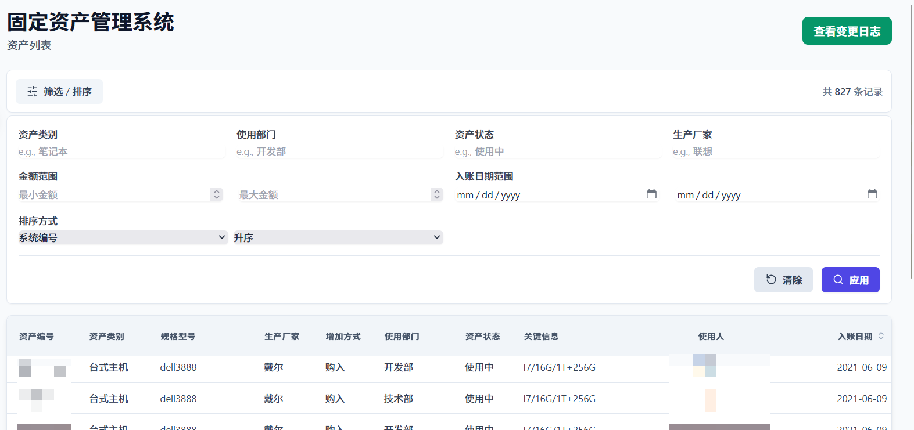

# Assets Manager (资产管理系统)

这是一个全栈资产管理系统项目，后端使用 Go (Gin 框架)，前端使用 SvelteKit 构建。整个应用被设计为可以轻松打包成一个独立的 Docker 镜像进行部署。


## ✨ 技术栈

*   **后端**: Go, Gin
*   **前端**: SvelteKit, Tailwind CSS
*   **包管理器**: pnpm
*   **数据库**: mysql
*   **部署**: Docker

## 🚀 项目依赖

在开始之前，请确保您的本地环境已经安装了以下工具：

*   [Go](https://go.dev/doc/install) (版本 1.25+)
*   [Node.js](https://nodejs.org/) (版本 24+)
*   [pnpm](https://pnpm.io/installation)
*   [Docker](https://www.docker.com/get-started/)

### 🔧 开发环境设置

为了获得最佳的开发体验（包括热重载），前端和后端需要分别在两个终端中独立运行。

**1. 克隆项目**
```bash
git clone <your-repository-url>
cd assets-manager
```

**2. 启动后端服务**

在项目根目录下，打开第一个终端：
```bash
# 下载 Go 模块依赖
go mod tidy

# 运行 Go 后端服务 (监听在 http://localhost:8123)
go run .
```
> **提示**: 为了获得后端代码的热重载功能，可以安装并使用 `air`:
> `go install github.com/cosmtrek/air@latest` 然后运行 `air`。

**3. 启动前端服务**

进入 `frontend` 目录，打开第二个终端：
```bash
# 进入前端目录
cd frontend

# 安装依赖
pnpm install

# 启动 SvelteKit 开发服务器 (监听在 http://localhost:5173)
pnpm run dev
```

现在，您可以在浏览器中打开 `http://localhost:5173` 来访问和开发您的应用了。所有对 API 的请求都会被 Vite 自动代理到后端。

### 📦 生产环境构建与部署 (Docker)

该项目使用多阶段构建的 Dockerfile 来创建一个轻量、安全、独立的生产镜像。

**1. 构建 Docker 镜像**

在项目根目录下运行以下命令来构建镜像：
```bash
# -t assets-manager:latest 给你的镜像命名为 'assets-manager'，标签为 'latest'
docker build -t assets-manager:latest .
```
